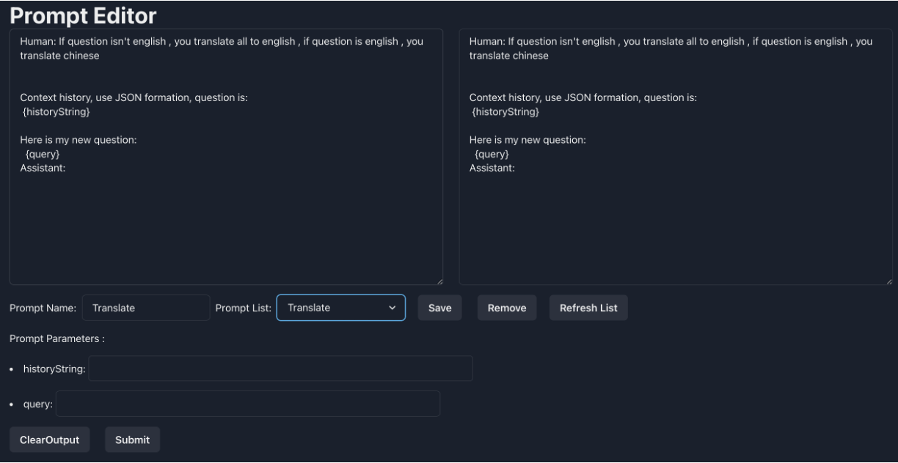
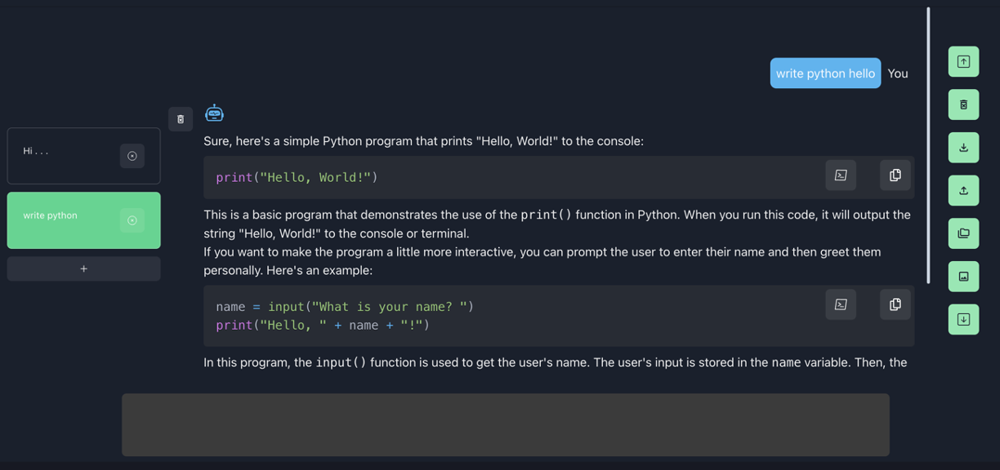
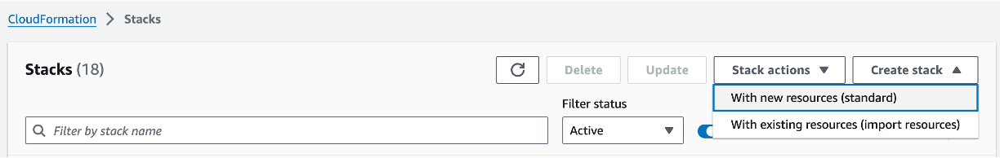
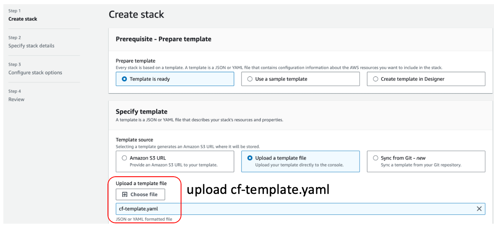
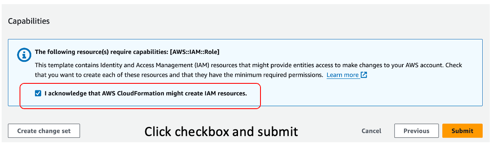
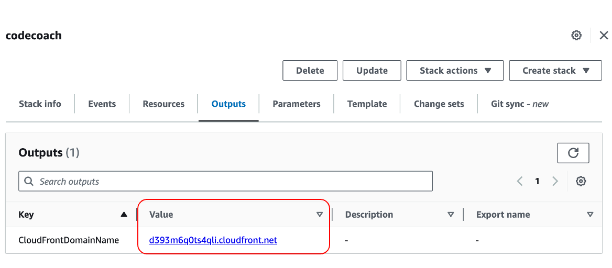
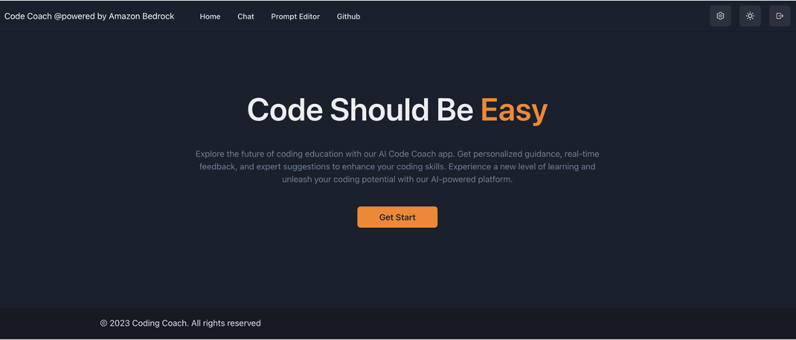
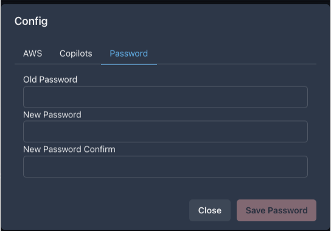

# Bedrock Claude CodeCoach

[中文版](./README.zh.md)

This repository is a sample code coach(include code interpreter ) using the Anthropic company's LLM [Claude 2](https://www.anthropic.com/index/claude-2), [Mistral](https://aws.amazon.com/bedrock/mistral/),  two of the foundational models provided by [Amazon Bedrock](https://aws.amazon.com/bedrock/) for generative AI. This sample is an innovative tool designed to assist developers in writing efficient and high-quality code .


## Architecture

It's an architecture built on AWS managed services, eliminating the need for infrastructure management. Utilizing Amazon Bedrock, there's no need to communicate with APIs outside of AWS. This enables deploying scalable, reliable, and secure applications.

- [Amazon DynamoDB](https://aws.amazon.com/dynamodb/): NoSQL database for user auth information storage
- [Amazon Bedrock](https://aws.amazon.com/bedrock/): Managed service to utilize foundational models via APIs
- [Amazon CloudFront](https://aws.amazon.com/cloudfront/) + [S3](https://aws.amazon.com/s3/): Frontend application delivery ([React](https://react.dev/), [Chakra UI](https://chakra-ui.com/))
- [Piston](https://github.com/engineer-man/piston) : code runtime
- [Amazon EC2](https://aws.amazon.com/ec2/)
- [Amazon Javascript sdk v3](https://docs.aws.amazon.com/AWSJavaScriptSDK/v3/latest/)


## Demo

https://github.com/stevensu1977/amazon-bedrock-coding-coach/assets/6694421/e59c7c1f-5054-4f3a-8729-970d6f57af11

CodeCoach Vimeo link:

[](https://vimeo.com/879129321 "CodeCoach")


Model: Claude Instant, Claude2/2.1, Claude3 Connect,  Mistral 7B, Mixtral 8x7B


Prompt Editor 



Workspace:



## Features and Roadmap

- [x] Authentication (Sign-up, Sign-in)

- [x] IAM Role support  

- [x] Prompt Editor

- [x] Workspace

- [ ] Docker Image 

- [ ] Docker Compose deploy file

- [x] Export chat history 

- [x] Syntax highlighting for code

- [x] Rendering of Markdown'

- [x] Streaming Response

- [x] Python runtime support 

- [x] PHP runtime support 

- [x] golang runtime support 

- [x] "How to fix " support

- [ ] CDN support 

- [ ] ECS support 

- [ ] Install script 

- [ ] Cloudfromation/ CDK deployment script

  

## Deployment (Cloudformation)

> Currently, we have only tested in the us-west-2 region. If you want to use another region, please fork this project, modify the region in the .env.local file, and also modify the init.sh file to clone the project from your repository for deployment. 


1. Option1.  Create cloudformation statc use AWS CLI tools. 

   ```bash
   #Replace <your_ec2_keypair> to your EC2 key pair.
   #Create Stack
   aws cloudformation create-stack --stack-name codecoach --template-body file://cf-template.yaml --parameters ParameterKey=SSHKeyName,ParameterValue=<your_ec2_keypair> --capabilities CAPABILITY_IAM
   
   #Check StackStatus , CREATE_COMPLETE
   aws cloudformation describe-stacks --stack-name codecoach --query "Stacks[0].StackStatus" --output text
   
   #Get CDN https url 
   aws cloudformation describe-stacks --stack-name codecoach --query "Stacks[0].Outputs[?OutputKey=='CloudFrontDomainName'].OutputValue" --output text
   
   
   
   
   ```


2. Option2.  Create cloudformation through web console

   Step1.   click create stack and upload cf-template.yaml

   

   

   Step2. Setup parameter and Submit

   

   

   Step3. Found cloudfront URL
   
   
   
3. Access CodeCoach, default user admin@demo.com/123456!@#,**please change your password when you first login!**

   ```
   https://<CDN_URL>
   ```
   

   

## Tips

- Claude 2 prompt guide  https://docs.anthropic.com/claude/docs/introduction-to-prompt-design

  

## Authors

- [Su Wei](https://github.com/stevensu1977)
- [Tang QingYuan](https://github.com/qingyuan18)
- [Gao Yu](https://github.com/GlockGao)
- [Yan Jun](https://github.com/yanjun-ios)

