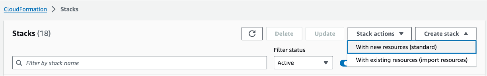
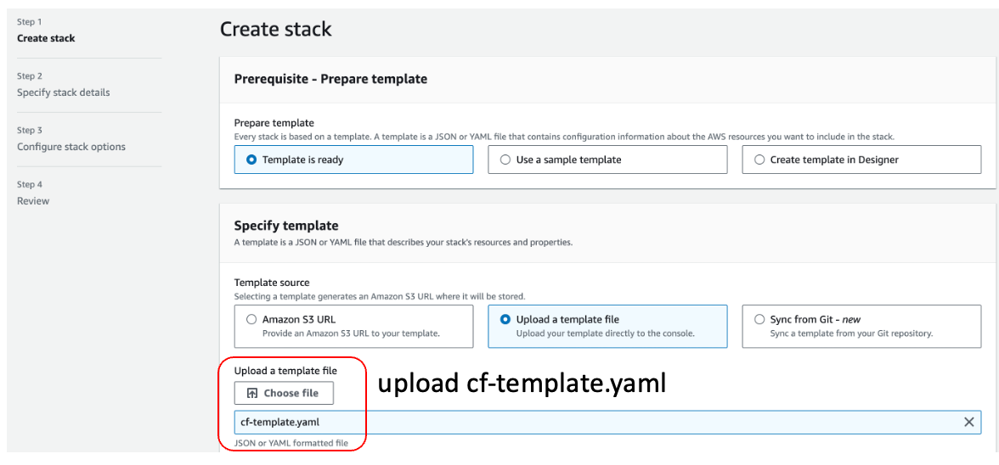
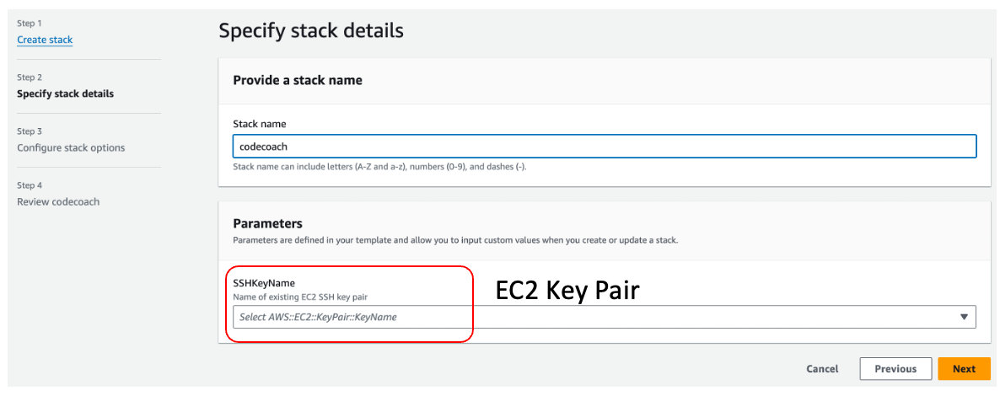
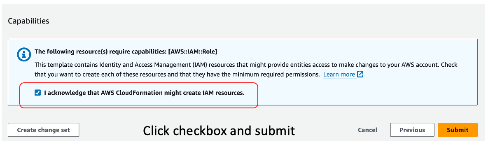
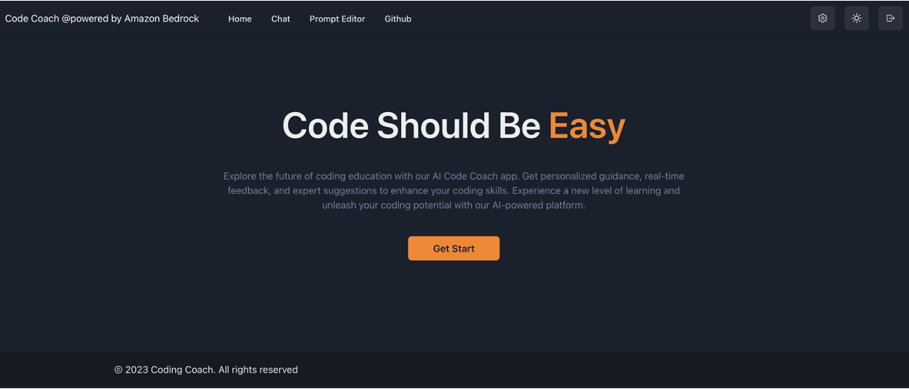

# Bedrock Claude CodeCoach


本项目是使用Amazon Bedrock和Anthropic公司的[Claude 2](https://www.anthropic.com/index/claude-2)大语言模型构建的一个代码助手，它包括***代码生成功能，代码执行功能，提示词模版编辑器***，支持***python, golang , nodejs, php,rust***语言的执行、编译、运行，而且这些环境内置了Amazon Web Service SDK。我们希望通过这个示例项目帮助大家了解 [Amazon Bedrock](https://aws.amazon.com/bedrock/) , Claude2, Mistral 7B的开发流程，提供开箱即用的组件，同时也希望这个项目可以帮助开发人员编写高效、高质量的代码,尤其是生成Amazon Web Service SDK的相关代码。


## 架构

It's an architecture built on AWS managed services, eliminating the need for infrastructure management. Utilizing Amazon Bedrock, there's no need to communicate with APIs outside of AWS. This enables deploying scalable, reliable, and secure applications.

- [Amazon DynamoDB](https://aws.amazon.com/dynamodb/): NoSQL database for user auth information storage
- [Amazon Bedrock](https://aws.amazon.com/bedrock/): Managed service to utilize foundational models via APIs
- [Amazon CloudFront](https://aws.amazon.com/cloudfront/) + [S3](https://aws.amazon.com/s3/): Frontend application delivery ([React](https://react.dev/), [Chakra UI](https://chakra-ui.com/))
- [Piston](https://github.com/engineer-man/piston) : code runtime
- [Amazon EC2](https://aws.amazon.com/ec2/)
- [Amazon Javascript sdk v3](https://docs.aws.amazon.com/AWSJavaScriptSDK/v3/latest/)


## 演示

https://github.com/stevensu1977/amazon-bedrock-coding-coach/assets/6694421/e59c7c1f-5054-4f3a-8729-970d6f57af11

CodeCoach 演示视频链接:

[](https://vimeo.com/879129321 "CodeCoach")


模型:  Claude Instant, Claude2/2.1, Claude3 Connect,  Mistral 7B, Mixtral 8x7B


提示词编辑器


## Features and Roadmap

- [x] Authentication (Sign-up, Sign-in)

- [x] IAM Role support  

- [x] Prompt Editor

- [ ] Docker Image 

- [ ] Docker Compose deploy file

- [x] Export chat history 

- [x] Syntax highlighting for code

- [x] Rendering of Markdown'

- [x] Streaming Response

- [x] Python runtime support 

- [x] PHP runtime support 

- [x] golang runtime support 

- [x] "How to fix " support

- [ ] CDN support 

- [ ] ECS support 

- [ ] Install script 

- [ ] Cloudfromation/ CDK deployment script

  

## 部署 (Cloudformation)

> 目前我们仅在us-west-2 区域做了测试，如果你要使用其它region,请fork这个项目，修改.env.local中的region,同时修改init.sh文件，从你的项目进行git clone 部署。 


1. 选项1.  使用AWS CLI命令行工具进行部署. 

   ```bash
   #Replace <your_ec2_keypair> to your EC2 key pair.
   #Create Stack
   aws cloudformation create-stack --stack-name codecoach --template-body file://cf-template.yaml --parameters ParameterKey=SSHKeyName,ParameterValue=<your_ec2_keypair> --capabilities CAPABILITY_IAM
   
   #Check StackStatus , CREATE_COMPLETE
   aws cloudformation describe-stacks --stack-name codecoach --query "Stacks[0].StackStatus" --output text
   
   #Get CDN https url 
   aws cloudformation describe-stacks --stack-name codecoach --query "Stacks[0].Outputs[?OutputKey=='CloudFrontDomainName'].OutputValue" --output text
   
   
   
   
   ```


2. 选项2.  使用Web控制台进行部署

   步骤1.  进入Cloudformation界面，点击创建Stack 并且上传cf-template.yaml文件

   

   

   步骤2. 设置EC2密钥对名字,点击下一步，确认后提交

   

   

   步骤3. Cloudformation Stack创建完成后查看 cloudfront 访问地址
   
   
   
3. 登录CodeCoach, 默认用户名密码: admin@demo.com/123456!@#,**首次登录后切记修改密码!**

   ```
   https://<CDN_URL>
   ```
   

   

## Tips

- Claude 2 提示词参考  https://docs.anthropic.com/claude/docs/introduction-to-prompt-design

  

## Authors

- [Su Wei](https://github.com/stevensu1977)
- [Tang QingYuan](https://github.com/qingyuan18)
- [Gao Yu](https://github.com/GlockGao)
- [Yan Jun](https://github.com/yanjun-ios)

